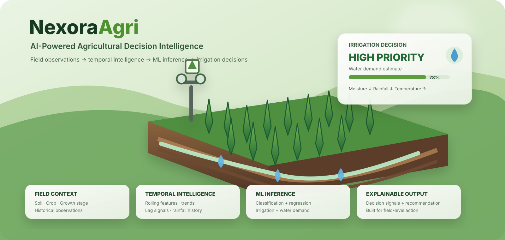

<div align="center">



# NexoraAgri

### AI-Powered Agricultural Decision Intelligence Platform

**Field-aware machine learning for smarter irrigation decisions.**

</div>

---

## Overview

NexoraAgri is an AI/ML-driven agricultural decision intelligence platform that transforms field-level environmental and crop observations into **actionable irrigation recommendations**.

Rather than applying a fixed irrigation schedule, NexoraAgri evaluates the context of an individual field — including **soil, crop, growth stage, soil moisture, rainfall, temperature, humidity, and historical observations** — to estimate irrigation demand and produce an explainable recommendation.

> **Raw observations → temporal feature engineering → ML inference → decision intelligence → irrigation recommendation**

---

## The Decision Problem

Irrigation demand changes continuously with field and environmental conditions. A single measurement or generic weather forecast is not enough to represent the state of a crop.

NexoraAgri is designed to answer:

**Does this field require irrigation?**

**How urgent is the requirement?**

**What level of water demand is estimated?**

**Which field conditions contributed to the recommendation?**

The result is a decision-oriented system rather than a simple prediction endpoint.

---

## Agricultural Intelligence Pipeline

```text
┌─────────────────────────────────────────────────────────────────────┐
│                         FIELD OBSERVATIONS                          │
│  Soil • Crop • Growth Stage • Moisture • Rainfall • Weather       │
└──────────────────────────────┬──────────────────────────────────────┘
                               │
                               ▼
                    ┌──────────────────────┐
                    │   DATA QUALITY       │
                    │   VALIDATION         │
                    └──────────┬───────────┘
                               │
                               ▼
                    ┌──────────────────────┐
                    │ TEMPORAL FEATURE     │
                    │ ENGINEERING          │
                    └──────────┬───────────┘
                               │
                               ▼
              ┌────────────────────────────────────┐
              │         FIELD CONTEXT              │
              │                                    │
              │  Soil  |  Crop  |  Weather         │
              │  Stage |  Moisture | History       │
              └─────────────────┬──────────────────┘
                                │
                                ▼
                       ┌─────────────────┐
                       │   ML INFERENCE  │
                       └────────┬────────┘
                                │
                    ┌───────────┴───────────┐
                    │                       │
                    ▼                       ▼
             CLASSIFICATION             REGRESSION
                    │                       │
                    ▼                       ▼
             Irrigation Class          Water Demand
             None / Low /              Estimation
             Medium / High
                    │                       │
                    └───────────┬───────────┘
                                ▼
                       ┌─────────────────┐
                       │ DECISION ENGINE │
                       └────────┬────────┘
                                │
                                ▼
                   EXPLAINABLE RECOMMENDATION
                                │
                                ▼
                         REACT DASHBOARD
```

---

## Field Context

NexoraAgri combines multiple signals to build a field-level representation before inference.

| Input | Intelligence captured |
|---|---|
| Soil type | Water retention and drainage characteristics |
| Crop | Crop-specific water requirements |
| Growth stage | Changing crop water demand |
| Soil moisture | Current water availability |
| Rainfall | Recent natural water input |
| Temperature | Environmental water demand |
| Humidity | Atmospheric conditions |
| Historical observations | Field-specific temporal behaviour |

---

## Temporal Intelligence

Agricultural observations are time-dependent. NexoraAgri therefore extracts temporal signals rather than treating every observation as an isolated record.

```text
Historical Observations
        │
        ├── Lag Features
        ├── Moisture Change
        ├── Rolling Statistics
        ├── Recent Rainfall
        ├── Cumulative Rainfall
        ├── Temperature Trends
        └── Short-Term Environmental Change
                         │
                         ▼
                 Predictive Signals
```

This enables the system to capture **how field conditions are evolving**, which is critical for irrigation decision-making.

---

## Dual-Model Intelligence

NexoraAgri separates irrigation decisions into two complementary ML tasks.

### Irrigation Classification

Predicts the irrigation requirement level:

`NONE` · `LOW` · `MEDIUM` · `HIGH`

### Water Demand Estimation

Estimates the approximate water demand associated with the current field condition.

### Decision Engine

The decision layer combines model outputs with field context to generate a recommendation that can be understood and acted upon.

---

## Explainability

A useful agricultural AI system should not stop at a prediction.

NexoraAgri is designed to expose the signals behind the decision.

```text
FIELD STATUS
────────────────────────────────────
Irrigation requirement     HIGH
Priority                   URGENT
Water demand               ESTIMATED

DECISION SIGNALS
────────────────────────────────────
Soil moisture              Below baseline
Recent rainfall            Limited
Temperature                Elevated
Growth stage               Higher demand

RECOMMENDATION
────────────────────────────────────
Prioritize irrigation for this field.
```

The purpose of explainability is to connect **model output with agricultural context** rather than present an unexplained classification.

---

## System Architecture

```text
                         NEXORAAGRI PLATFORM
                                  │
             ┌────────────────────┴────────────────────┐
             │                                         │
             ▼                                         ▼
       React Dashboard                           ML Pipeline
             │                                         │
             │                              ┌──────────┴──────────┐
             │                              │                     │
             │                              ▼                     ▼
             │                       Feature Engineering    ML Inference
             │                              │                     │
             │                              └──────────┬──────────┘
             │                                         │
             └──────────────────┬──────────────────────┘
                                ▼
                         Decision Engine
                                │
                                ▼
                     Explainable Recommendation
```

---

## Technology Stack

### Machine Learning

`Python` · `Pandas` · `NumPy` · `Scikit-learn`

Feature engineering · temporal analysis · classification · regression · predictive modeling

### Backend

`Python` · `FastAPI` · `REST APIs` · data validation · model serving

### Frontend

`React` · `JavaScript / TypeScript` · interactive dashboard · data visualization

---

## End-to-End Workflow

```text
FIELD DATA
    │
    ▼
VALIDATION
    │
    ▼
PROCESSING
    │
    ▼
TEMPORAL FEATURE ENGINEERING
    │
    ▼
MODEL INFERENCE
    │
    ▼
IRRIGATION CLASSIFICATION + WATER DEMAND
    │
    ▼
DECISION ENGINE
    │
    ▼
EXPLAINABLE RECOMMENDATION
    │
    ▼
DASHBOARD
```

---

## Project Structure

```text
NexoraAgri/
│
├── frontend/              # React application and dashboard
├── backend/               # API, inference and decision services
├── models/                # ML model artifacts / pipelines
├── data/                  # Agricultural datasets
├── notebooks/             # EDA and ML experimentation
├── docs/                  # Architecture and project documentation
└── README.md
```

---

## Roadmap

```text
Core irrigation intelligence             ████████████████████  Complete
Temporal feature engineering             ████████████████████  Complete
Irrigation classification                ████████████████████  Complete
Water demand estimation                  ████████████████████  Complete
Explainable recommendations              ████████████████████  Complete

Real-time weather integration             ░░░░░░░░░░░░░░░░░░░░  Planned
IoT soil sensors                          ░░░░░░░░░░░░░░░░░░░░  Planned
Multi-field farm management               ░░░░░░░░░░░░░░░░░░░░  Planned
Satellite / remote sensing                 ░░░░░░░░░░░░░░░░░░░░  Planned
Irrigation scheduling                      ░░░░░░░░░░░░░░░░░░░░  Planned
Model monitoring                          ░░░░░░░░░░░░░░░░░░░░  Planned
Edge / IoT deployment                     ░░░░░░░░░░░░░░░░░░░░  Planned
```

---

## Getting Started

```bash
git clone https://github.com/deekshitaa1/NexoraAgri.git
cd NexoraAgri
```

### Backend

```bash
cd backend
python -m venv .venv

# Windows
.venv\Scripts\activate

# Linux / macOS
source .venv/bin/activate

pip install -r requirements.txt
```

Start the API using the project's configured backend entry point.

### Frontend

```bash
cd frontend
npm install
npm run dev
```

---

## Vision

NexoraAgri is built around a simple principle:

> **Agricultural data becomes valuable when it can support a better decision.**

The platform connects field observations, temporal patterns, machine learning, and explainable recommendations into a single agricultural intelligence workflow.

```text
OBSERVE  →  UNDERSTAND  →  PREDICT  →  DECIDE  →  ACT
```

---

<div align="center">

### NexoraAgri

**Smarter Irrigation. Better Field Intelligence. More Sustainable Agriculture.**

</div>
